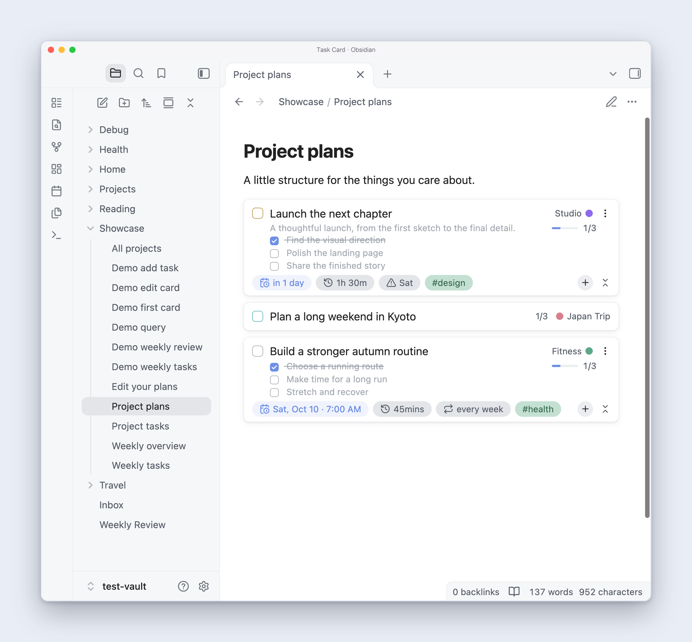
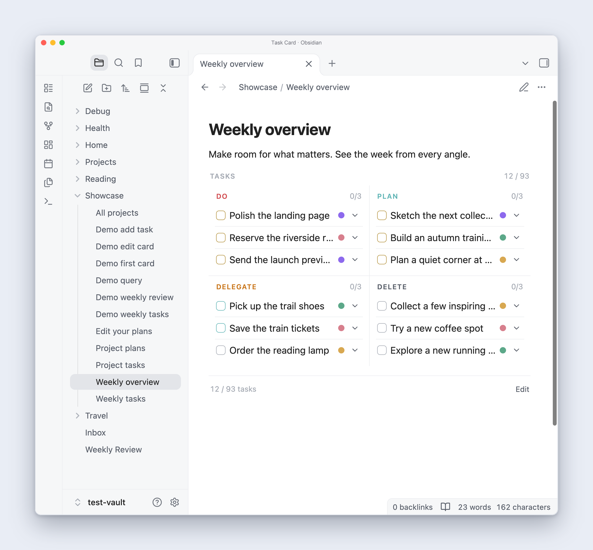
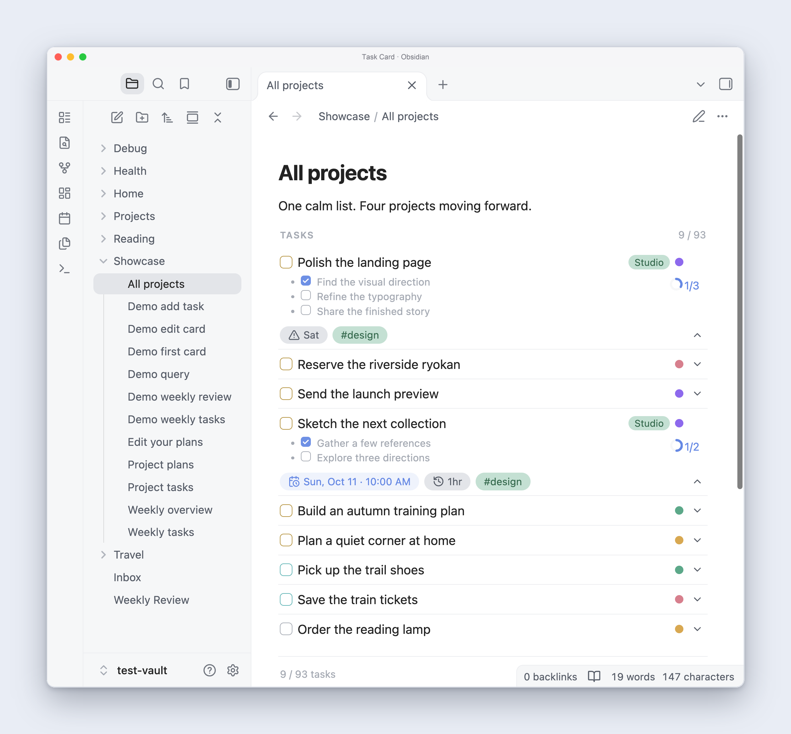
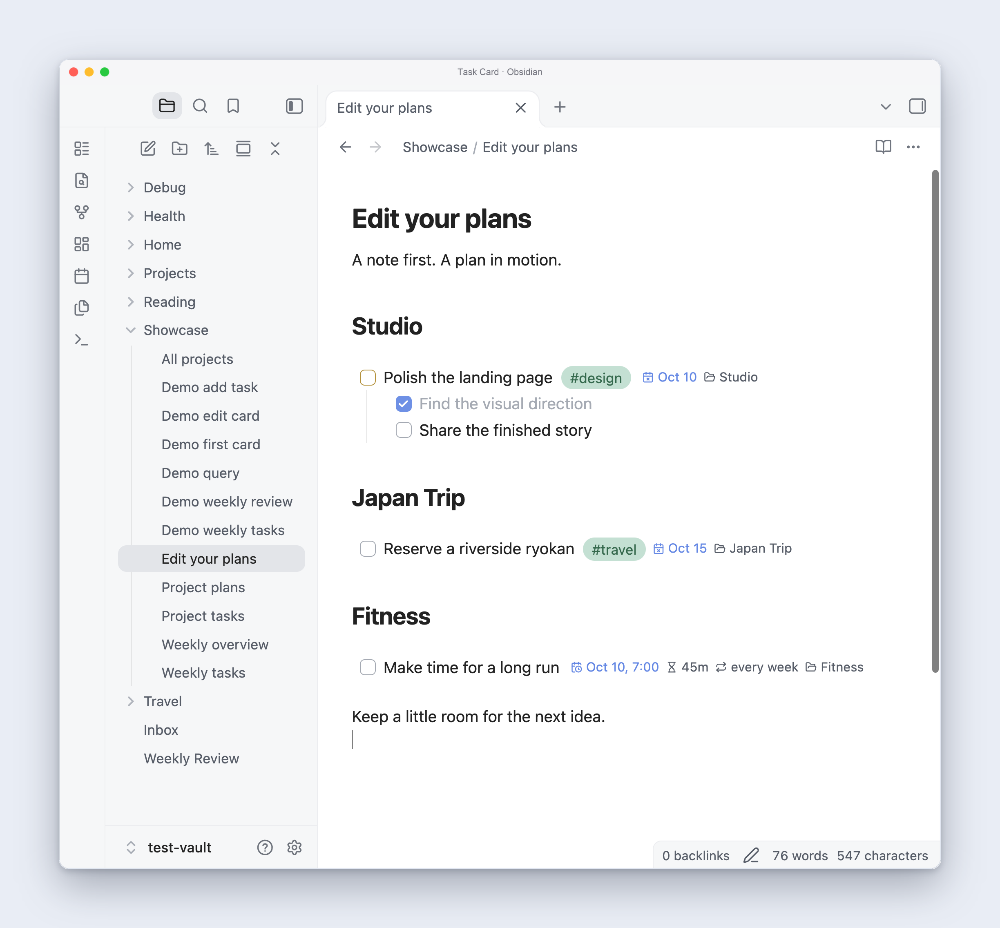
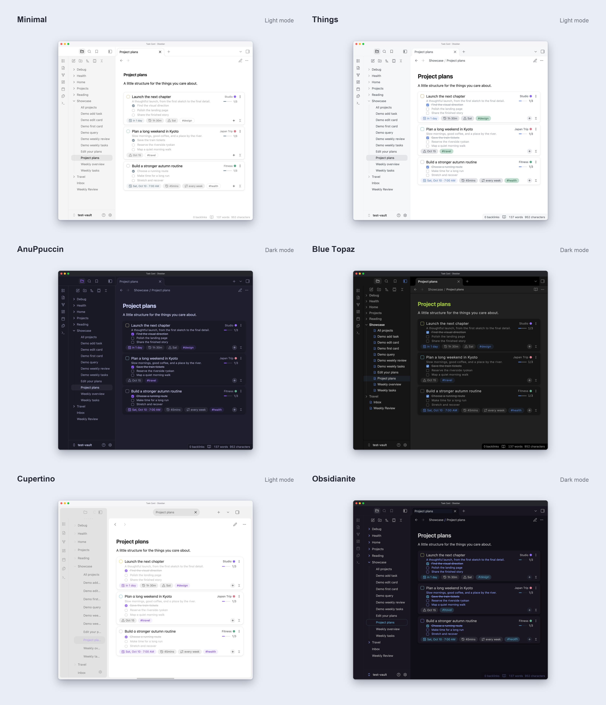
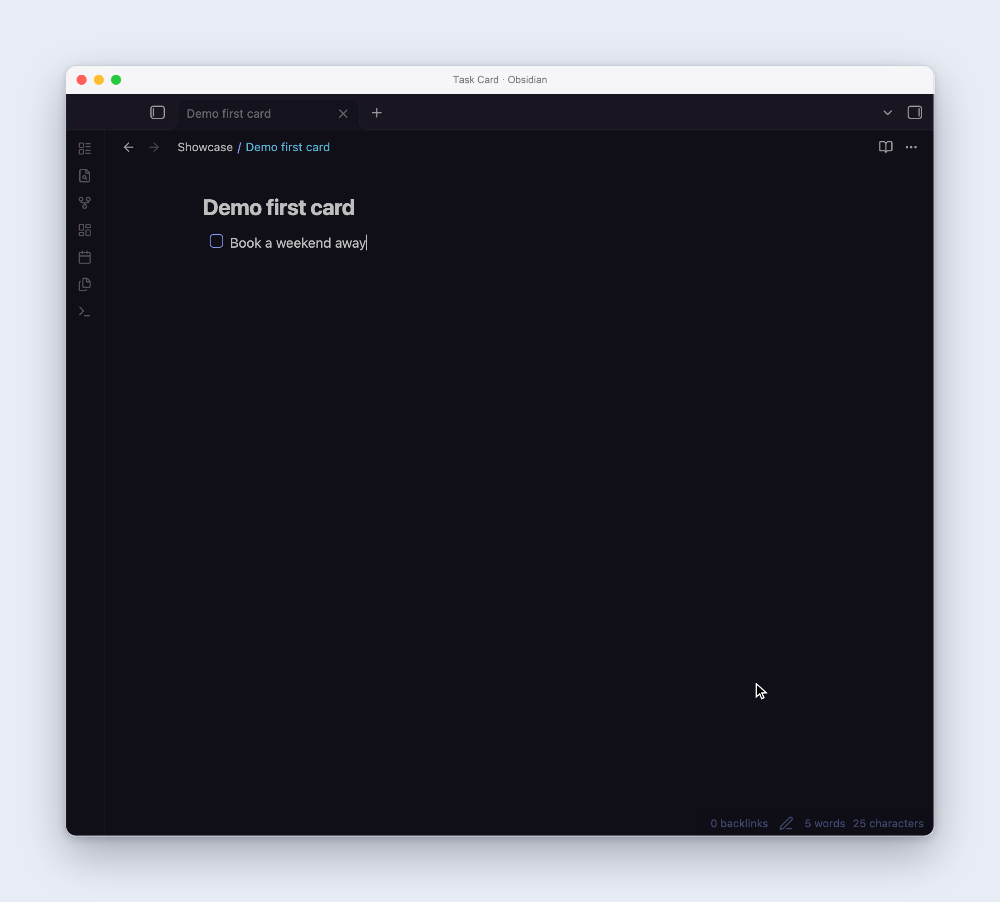
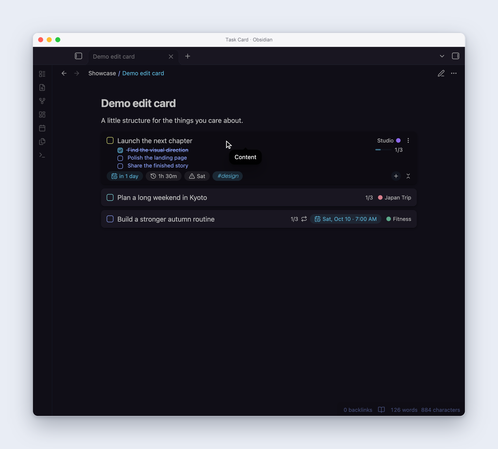
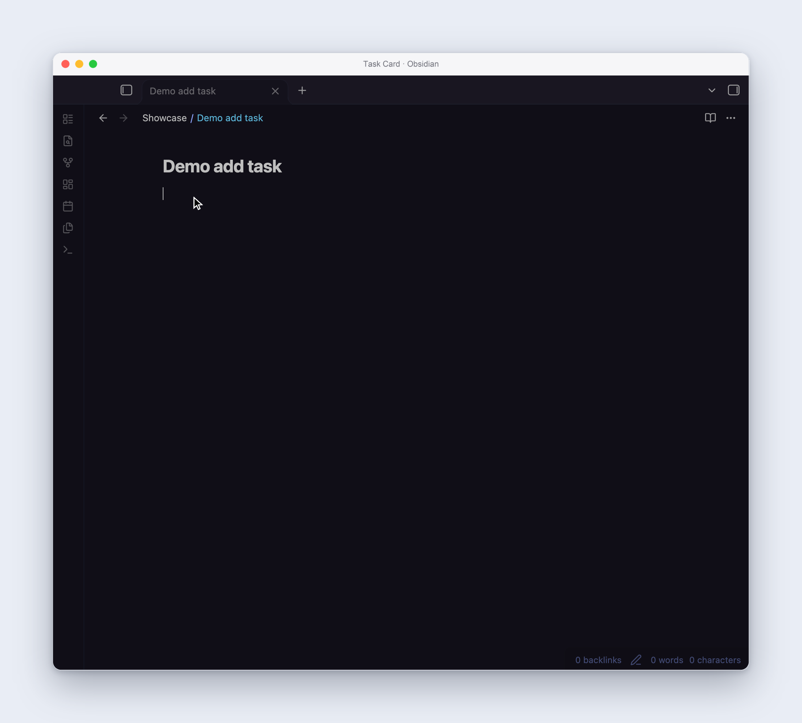
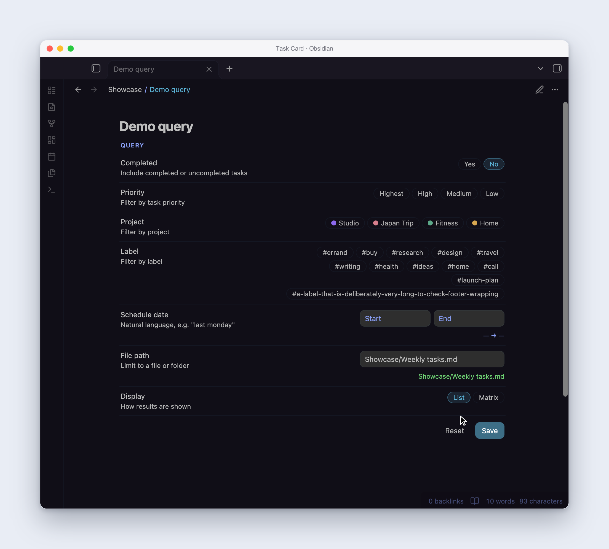
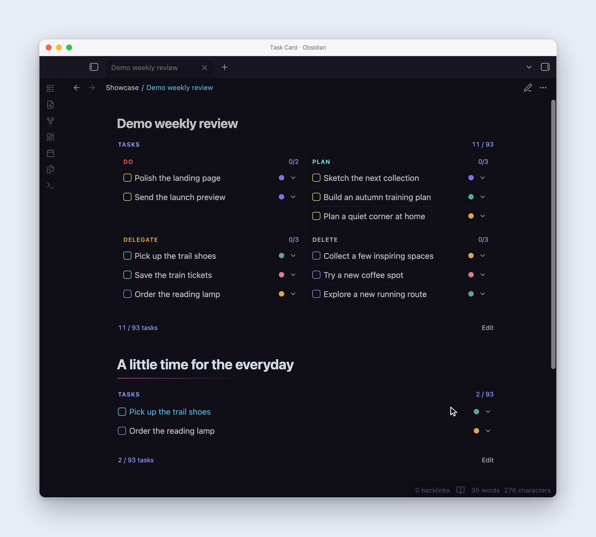

# Task Card

**Your tasks, beautifully in view.**

Turn Markdown checkboxes into interactive cards. Give each project its own color, break big plans into subtasks, and bring everything together in a list or a weekly matrix. Your tasks stay in your Obsidian notes.

[Find Task Card in Obsidian](https://community.obsidian.md/plugins/task-card) · [Get started](#start-with-one-task) · [Download the latest release](https://github.com/terryli710/Obsidian-TaskCard/releases/latest)

[](assets/showcase/project-cards.png "View full size")

**A card for the whole plan.** See the next step, the deadline, and the details together. Check off subtasks as you go; the progress bar keeps track. Expand a card to work on it, or collapse it to keep your notes light.

## See your projects from every angle

### Make room for what matters

The Eisenhower matrix gives your tasks four places: **Do, Plan, Delegate, and Delete**. Priority and due dates determine where each task appears, while project colors keep its context close. Compact rows keep the board tidy; hover for a full title or expand a task for its details.

[](assets/showcase/weekly-matrix.png "View full size")

### Bring it all into one calm list

Gather tasks from different notes into a single view. Compact rows keep project dots and expand controls aligned; open individual tasks to see their subtasks and metadata alongside the rest of your list. Filter by project, label, priority, completion, schedule, or file. Complete a task from the results, or jump straight to its original note.

[](assets/showcase/project-list.png "View full size")

### Keep writing in your notes

In **Live Preview**, dates, projects, and recurring schedules become compact metadata chips alongside your task text. Write a note, add a subtask, or edit a field in place; switch to Reading view when you want the full card.

[](assets/showcase/edit-mode.png "View full size")

## Your theme. Your tasks.

Task Card takes its colors and typography from Obsidian, so it feels at home in the workspace you've already made your own.

Here are the same project cards in [Minimal](assets/showcase/themes/minimal.png), [Things](assets/showcase/themes/things.png), [AnuPpuccin](assets/showcase/themes/anuppuccin.png), [Blue Topaz](assets/showcase/themes/blue-topaz.png), [Cupertino](assets/showcase/themes/cupertino.png), and [Obsidianite](assets/showcase/themes/obsidianite.png). Select a theme name to see its full-size window. The gallery mixes light and dark appearances; all six were checked in both modes.

[](assets/showcase/themes.png "View full size")

Minimal, Things, AnuPpuccin, and Blue Topaz are among the [most downloaded Obsidian themes](https://releases.obsidian.md/stats/theme). The screenshots above come from the actual plugin in Obsidian.

## Start with one task

### 1. Write it. Tag it. Make it a card.

Add `#TaskCard` to an ordinary Markdown task:

```markdown
- [ ] Book a weekend away #TaskCard
```

Switch to **Reading view** to see the card. Click it to expand, and click the checkbox when it's done. You can change the indicator tag in Task Card's settings.

<details>
<summary>Watch: create your first card</summary>

[](assets/showcase/demos/quick-start.png "View full size")

</details>

### 2. Add the details as you need them

Click an attribute to edit it in place, or use **+** to add one. Cards support projects, priorities, due dates, scheduled time, duration, labels, and recurrence. Indented text becomes the description; indented checkboxes become subtasks.

```markdown
- [ ] Plan a weekend in Kyoto #TaskCard #travel [project:: Japan Trip]
    - [x] Save the train tickets
    - [ ] Reserve a place by the river
    - [ ] Map a quiet morning walk
```

<details>
<summary>Watch: edit a card without leaving your note</summary>

[](assets/showcase/demos/edit-a-card.png "View full size")

</details>

For quick captures, use **Quick add task** from the command palette. It understands shorthand like `Review the draft tomorrow 3pm for 1h !high #writing @Studio every week`. When typing fields in a note, autosuggest helps you choose attributes and natural-language dates such as `tomorrow` or `next fri 2pm`.

<details>
<summary>Watch: add a task in your note</summary>

[](assets/showcase/demos/add-a-task.png "View full size")

</details>

### 3. Build a view of your own

Add a `taskcard` code block to any note. Use the visual editor to choose filters, or write a small query yourself:

````markdown
```taskcard
project: ["Japan Trip"]
completed: [false]
editMode: false
```
````

Queries and the matrix need [Dataview](https://github.com/blacksmithgu/obsidian-dataview). Individual cards work without it.

<details>
<summary>Watch: gather tasks with the visual query editor</summary>

[](assets/showcase/demos/query-builder.png "View full size")

</details>

To make the same view a matrix, add `display: "matrix"`:

````markdown
```taskcard
completed: [false]
display: "matrix"
editMode: false
```
````

<details>
<summary>Watch: complete tasks and review your week</summary>

[](assets/showcase/demos/weekly-review.png "View full size")

</details>

## Beautiful cards. Ordinary Markdown.

Everything you add through a card stays readable in your notes. Projects and dates use Dataview inline fields, labels are normal hashtags, and task identity uses Obsidian block IDs.

```markdown
- [ ] Book flights to Tokyo #travel #TaskCard [priority:: high] [due:: 2026-10-16] [project:: Japan Trip] ^tc-b3xr9d
```

- **Keep your notes yours.** Read and edit your tasks in Obsidian, a text editor, or on your phone. The task text remains useful if you remove the plugin.
- **Work with existing tasks.** Tasks from the [Tasks plugin](https://github.com/obsidian-tasks-group/obsidian-tasks) can use their existing emoji or Dataview fields; their format is preserved until you edit them through a card.
- **Build a routine.** Complete a recurring task and Task Card creates its next occurrence using the Tasks recurrence grammar.
- **Stay close to your writing.** Live Preview displays task metadata as compact chips while you edit the note.

## Install Task Card

Open the [Task Card community page](https://community.obsidian.md/plugins/task-card). If installation is available, choose **Add to Obsidian**, then install and enable the plugin. Install **Dataview** as well if you want queries or the matrix.

For early access while a directory review is pending, add `terryli710/Obsidian-TaskCard` through [BRAT](https://tfthacker.com/BRAT).

For manual installation, download `plugin-release.zip` from the [latest release](https://github.com/terryli710/Obsidian-TaskCard/releases/latest), create `.obsidian/plugins/task-card/` in your vault, and place `main.js`, `manifest.json`, and `styles.css` inside it. Enable Task Card under **Settings → Community plugins**.

## A few useful answers

**Does it work on mobile?** Yes. Cards and queries support desktop and mobile Obsidian.

**Do I need Dataview?** Only for query lists and the matrix. Cards themselves work without it.

**Can I migrate older Task Card tasks?** Use **Migrate legacy tasks to the new format** to convert tasks from the older format into plain-text fields.

**What if my theme needs a little attention?** [Open an issue](https://github.com/terryli710/Obsidian-TaskCard/issues) with the theme name and a screenshot. The showcase covers several popular themes; individual theme customizations can still affect rendering.

[Apache 2.0 license](LICENSE)
