# Create a New Client of Google Calendar to Use Google Calendar Sync of Task Card Obsidian

> [!NOTE]  
> The whole process only takes about 5-10 mins.

## Step 1: Create a new project in Google Cloud Platform
> [!IMPORTANT]  
> If you haven't got a GCP project for calendar API, create one!
- Click [HERE](https://console.cloud.google.com/projectcreate) to start creating a google cloud platform project;
- Give the project a name, e.g. "CalendarAPI" and hit `CREATE`;
- 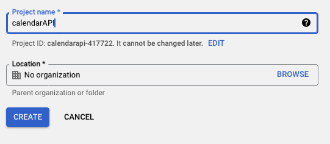

## Step 2: Enable Google Calendar API

> [!WARNING]  
> Make sure you are on the right project. e.g. "CalendarAPI"

- In your new project, `ENABLE` [Google Calendar API](https://console.cloud.google.com/marketplace/product/google/calendar-json.googleapis.com) 
- 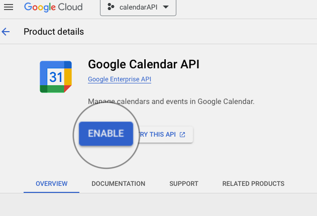

## Step 3: Set `OAuth Consent Screen`
- Go to the [OAuth Consent Screen](https://console.cloud.google.com/apis/credentials/consent) tab of your project.
1. **OAuth Consent Screen**:
   - Select **User Type** = `External`, and `CREATE`;
   - 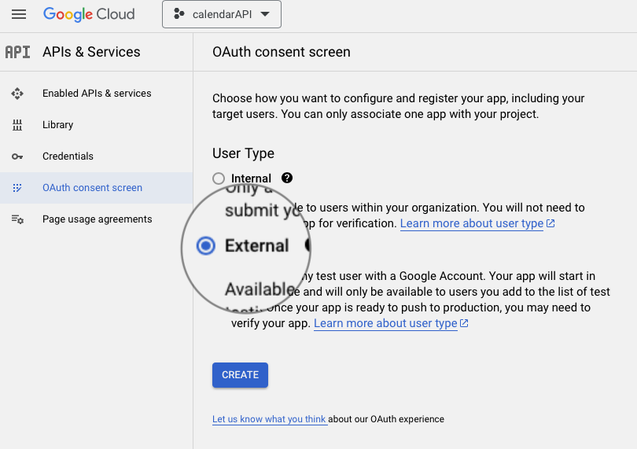
   - Put in your App Information:
    - **App name** = `Obsidian Task Card`;
    - **User support email** = \<Your Email\>;
    - **Developer contact information** = \<Your Email\>;
   - Click `SAVE AND CONTINUE`;
2. **Scopes**:
   - Click on **Add or Remove Scopes**;
   - 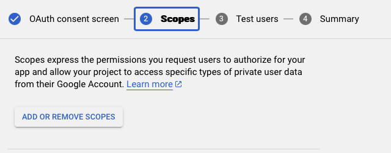
   - Choose these Scopes:
     - **Scope** = `.../auth/userinfo.email`;
     - **Scope** = `.../auth/userinfo.profile`;
     - **Scope** = `openid`;
     - 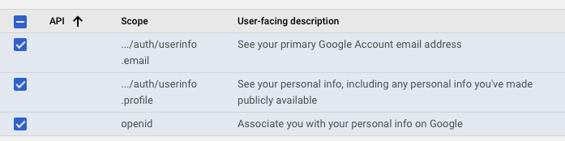
     - **API** = `Google Calendar API` (you can search for API name in the filter);
     - 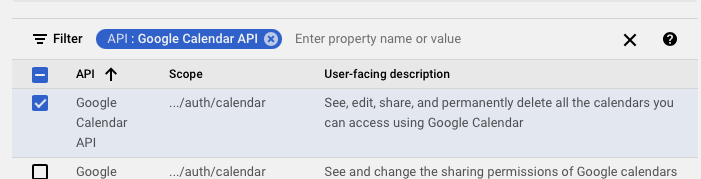
   - Click on `UPDATE`;
   - You should see 3 fields in **Your non-sensitive scopes**:
     - `.../auth/userinfo.email`
     - `.../auth/userinfo.profile`
     - `openid`
   - And 1 field in **Your sensitive scopes**:
     - `Google Calendar API`
   - 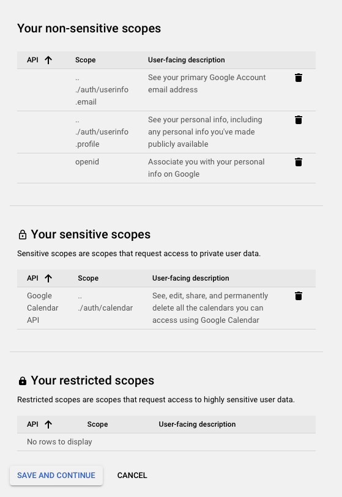
   - If correct, click `SAVE AND CONTINUE`;
3. Test Users:
   - Click on `ADD USERS`;
   - Input \<Your Email\>;
   - Click on `ADD`;
   - You should see your email showing in the **User information**;
   - Click on `SAVE AND CONTINUE`;
   - 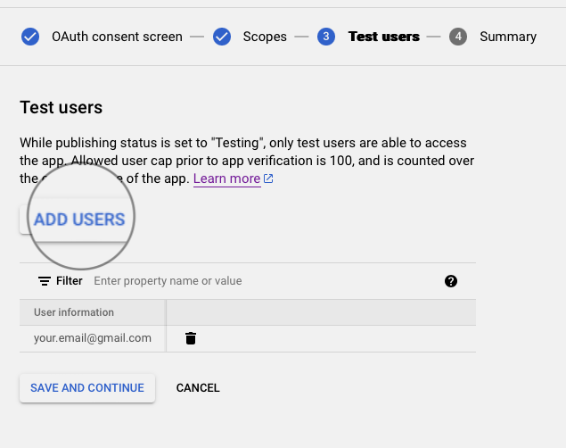
- Summary:
  - Click on **BACK TO DASHBOARD**;

## Step 4: Setup Credentials

- Go to the [Credentials](https://console.cloud.google.com/apis/credentials) tab of your project.
- Click on `CREATE CREDENTIALS`;
- 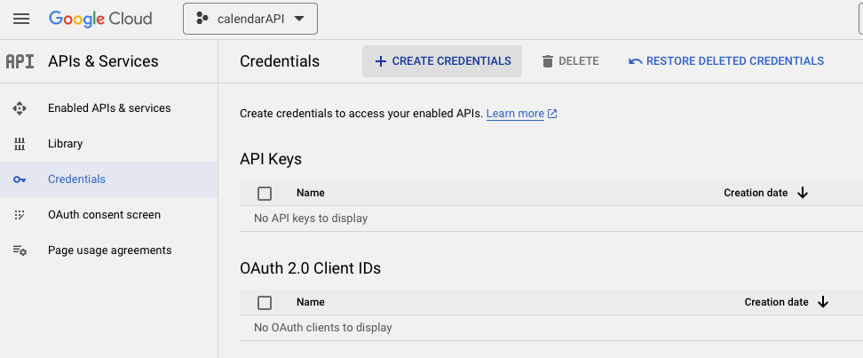
- Select **OAuth Client ID**;
- 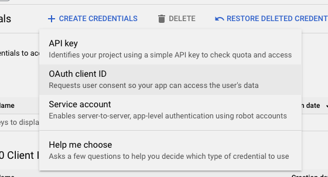
- **Application type** = `Web Application`;
- **Name** = `Obsidian Task Card`;
- **Authorized JavaScript origins** = `http://127.0.0.1:8888`;
- **Authorized redirect URIs** = `http://127.0.0.1:8888/callback`;
- 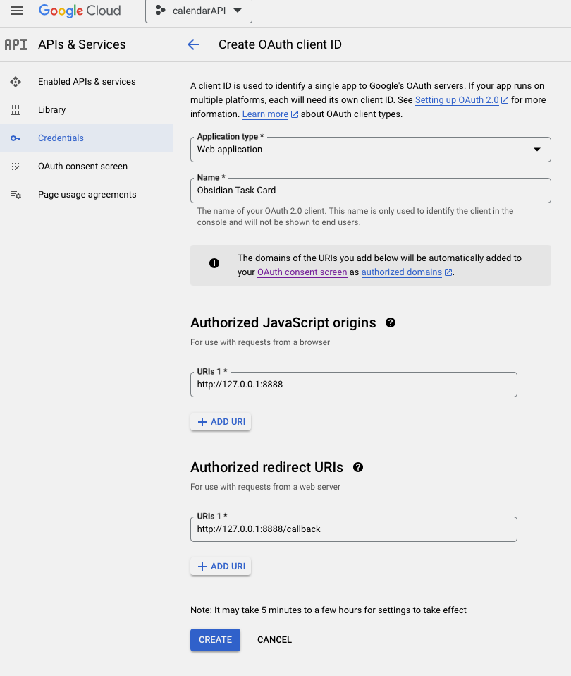
- Click on `CREATE`;

## Copy and Paste Your Client ID and Secret

- Copy the **Client ID** and **Client Secret**.
- 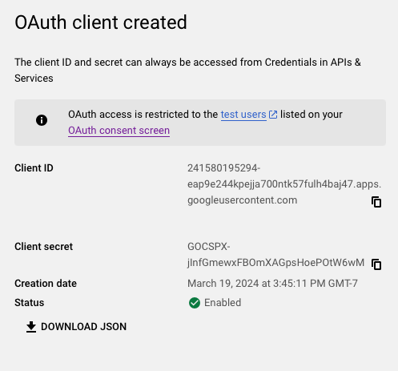
- Go to *Obsidian -> Settings -> Community Plugins -> Task Card -> Google Calendar Sync -> Login via Google*, paste the **Client ID** and **Client Secret**
- 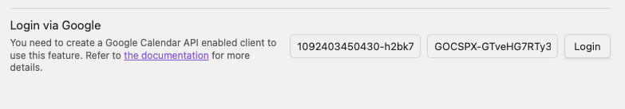
- Click on **Login**, this will take you to the login page of the plugin.
- Select the correct google account and login.
- "*Google hasn’t verified this app*": Click on **Continue** because you created the application.
- 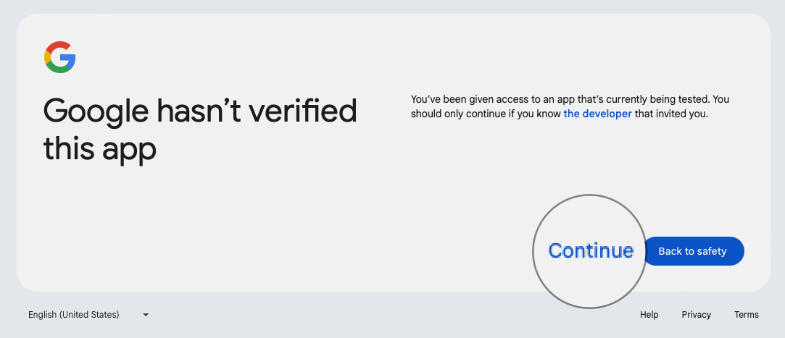 
- You should see login successful message.